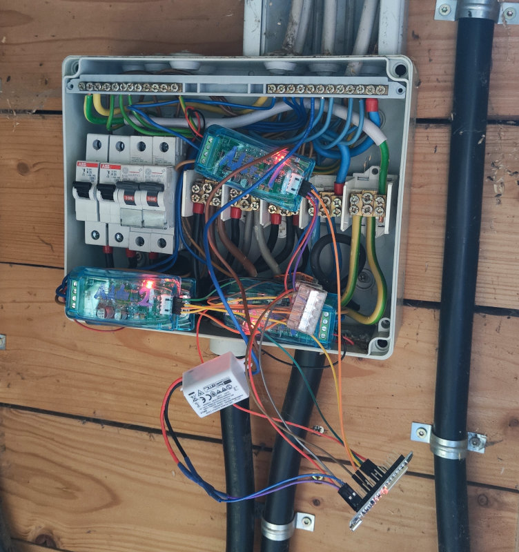
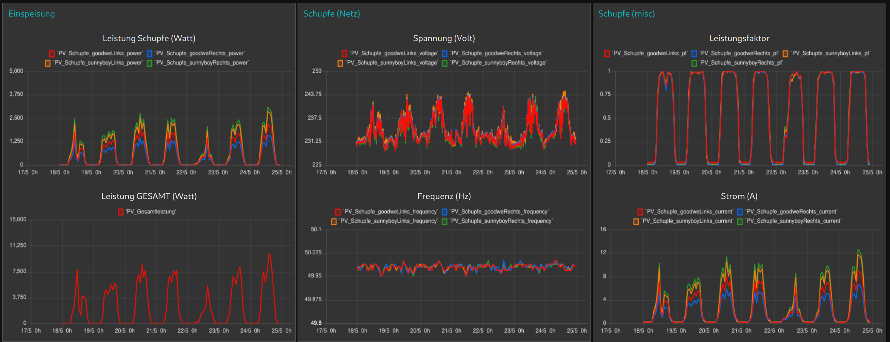

# ESP32 PV Power Monitoring System

This project provides a system to monitor photovoltaic (PV) power production using multiple **PZEM-004T** power measurement modules connected to an **ESP32** that regularly publishes the values via MQTT.  
It also includes a Python utility for configuration and direct serial access to PZEM modules.

## Temporary Hardware Setup


*This is an initial and extremely unsafe proof-of-concept wiring setup for measuring the power output of four inverters. Do **not** use this as a reference for permanent or safe installations.*

## Resulting dashboard


*Preview of the dashboard created using the received data (not included in this repo)*

---

## Firmware (ESP32)
The firmware connects to one or more **PZEM-004T v3** modules via UART and regularly publishes power data via **MQTT**.

- Developed with **ESP-IDF 5.3**
- Configurable for multiple PZEM modules on the same UART (module RX shared) (modbus addressing)
- Each modules TX is connected to a separate RX pin of the esp32 (individually configurable)
- Publishes real-time values like voltage, current, power, energy, frequency, and power factor


### Build and Flash
Make sure ESP-IDF 5.3 is sourced:

```bash
. /opt/esp-idf-v5.3/v5.3/esp-idf/export.sh
cd esp32_power-monitor
idf.py build flash monitor
```

---

## Python Tool (`power-meter.py`)

This is a utility script for **directly configuring PZEM modules** via an FTDI USB-to-Serial adapter.  
Useful for:
- Reading raw data via serial
- Setting or changing the Modbus slave address
- Resetting the energy counter

### Requirements
- Python 3
- `pyserial` installed (`pip install pyserial`)

### Usage
1. Connect **RX/TX** of the FTDI adapter to the **TX/RX** of the PZEM module.
2. Plug the adapter into your PC.
3. Edit `pzem_tool.py`:
   - Set the correct serial port and slave ID
   - Uncomment the function you want to run (read, configure, reset)

Then run the script:

```bash
python3 pzem_tool.py
```

---

## Repo Structure

```
esp32_power-monitor/      # ESP-IDF firmware project
power-meter.py            # Python script for config and debug via USB serial
README.md                 # This file
```

---

## Notes

- Make sure PZEM modules are properly addressed and wired using UART (shared TX/RX with different slave IDs).
- Each PZEM module should be fused correctly before connecting to 230V (see safety notes).
- MQTT credentials and broker details are configured in `sdkconfig`.

---
