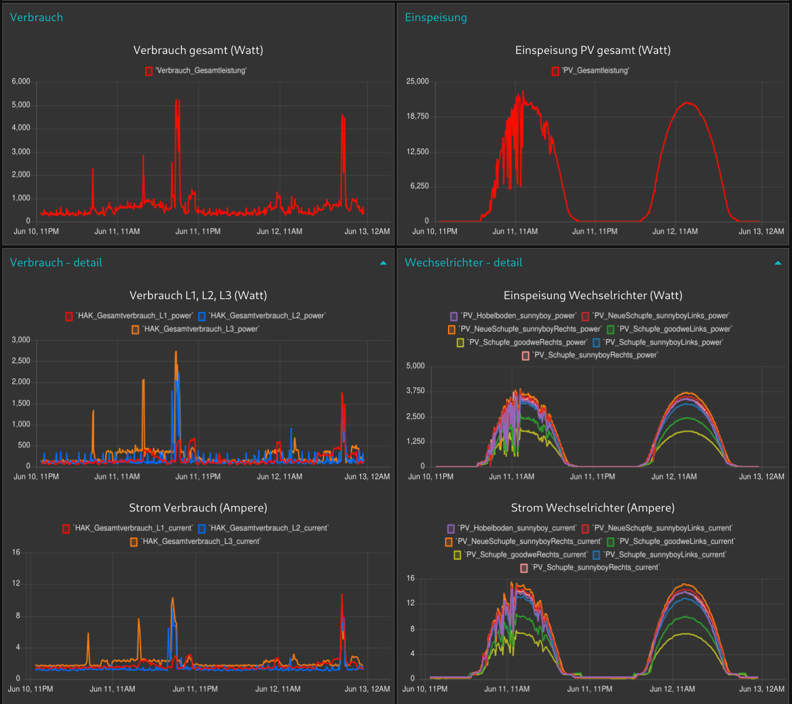
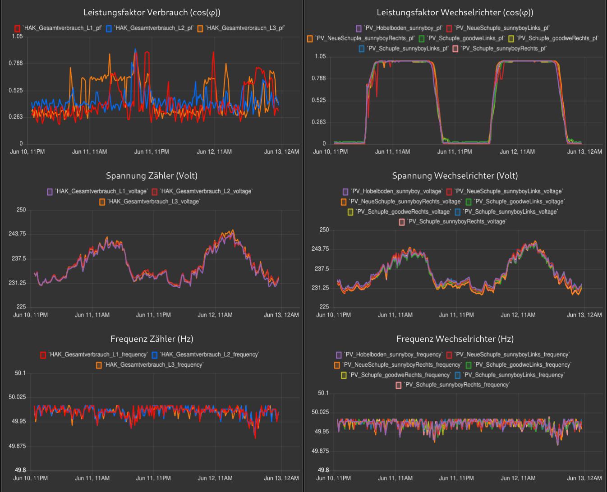
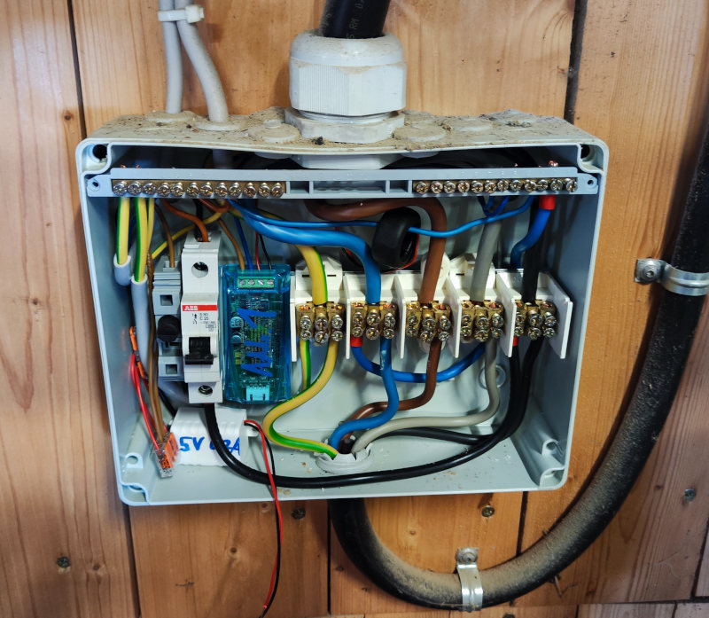
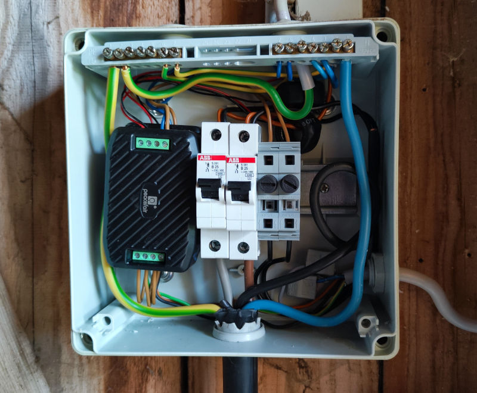
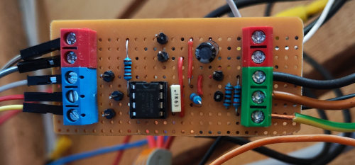

# ESP32 PV Power Monitoring System

This project documents a system for monitoring photovoltaic (PV) power production and household power consumption using **ESP32** and **PZEM-004T** / **PZEM-016** power sensors, with data published over **MQTT**.

Included in this repo:

- Firmware for several ESP32 individually configured breakout boards, built with ESP-IDF 5.3
- Python utility for configuring PZEM modules over USB serial
- Hardware project for a custom UART ↔ RS485 interface board (KiCad) for a simple stripboard

---

## Dashboard Demo

The following screenshots show the resulting dashboard created using Node-RED where the sensor data is received via MQTT and stored in a database.
The charts visualize all sensor values across multiple inverters and locations.

### Live Chart View (Total sum, Active power, Current)



---

### Live Chart View (Power factor, Voltage, Frequency)



---

## Hardware Setup

Below are a few example photos of the current wiring and hardware setup.

### 3x PZEM-003T measuring total consumption (main distribution board)

  
Used for measuring total consumption of the entire building. One module for each phase (L1, L2, L3).

---

### Single PZEM-004T (inverter distribution box)

  
Each module is wired to one phase of a single inverter output.

---

### 2× PZEM-016 via RS485 (distribution box Remote inverters)

  
PZEM-016 modules connected via a shared RS485 bus and assigned separate Modbus addresses.  
On the other side of a ~30 m 5×1.5 mm² power cable, an ESP32 with a custom RS485-to-UART PCB receives the data and publishes it via MQTT.

---

## UART ↔ RS485 Interface (Custom PCB)

To interface the ESP32 with RS485-based PZEM-016 sensors, a small PCB based on the **MAX3485** transceiver was created.

- KiCad Project: [`hardware/UART-RS485_interface-board/`](hardware/UART-RS485_interface-board/)
- Schematic PDF: [`schematic.pdf`](hardware/UART-RS485_interface-board/export/schematic.pdf)

### Photo while testing



---

## Firmware (ESP32)

Firmware for reading multiple PZEM modules and publishing the values via MQTT.  
Tested with ESP-IDF 5.3.

### Features

- Supports **PZEM-004T v3** (TTL UART) and **PZEM-016** (RS485)
- Configurable (per module):
  - Sensor address
  - GPIO pins (TX, RX, RTS)
  - MQTT topic prefix
  - Publish interval
  - Sensor type (TTL / RS485)
- Reads and publishes:
  - Voltage
  - Current
  - Power
  - Energy
  - Frequency
  - Power factor

### Build and Flash
Make sure ESP-IDF 5.3 is sourced:

```bash
. /opt/esp-idf-v5.3/v5.3/esp-idf/export.sh
cd esp32_power-monitor
idf.py build flash monitor
```

---

## Python Utility (`power-meter.py`)

Utility script for directly configuring and reading PZEM modules using a USB-to-Serial adapter.

### Functions

- Set or change Modbus address
- Reset energy counter
- Read live values

### Requirements

```bash
pip install pyserial
```

### Usage
1. Connect **RX/TX** of the FTDI adapter to the **TX/RX** of the PZEM module.
2. Plug the adapter into your PC.
3. Edit `pzem_tool.py`:
   - Set the correct serial port and slave ID
   - Uncomment the function you want to run (read, configure, reset)

Then run the script:

```bash
python3 pzem_tool.py
```

---

## Repository Structure

```
firmware/    # Several ESP-IDF projects for all instances running
hardware/UART-RS485_interface-board/   # KiCad project for interface PCB
doc/images/                            # photos and documentation
```

---

## Notes

- PZEM modules must be addressed and wired correctly (especially for RS485).
- Each PZEM sensor input should be fused and installed safely. Here i used a 200 mA 5x20 mm fuse for each module in the gray WAGO fuse holders for DIN rail.
- Wi-Fi credentials are configured via `main/credentials.h` which is not tracked in the repo.
